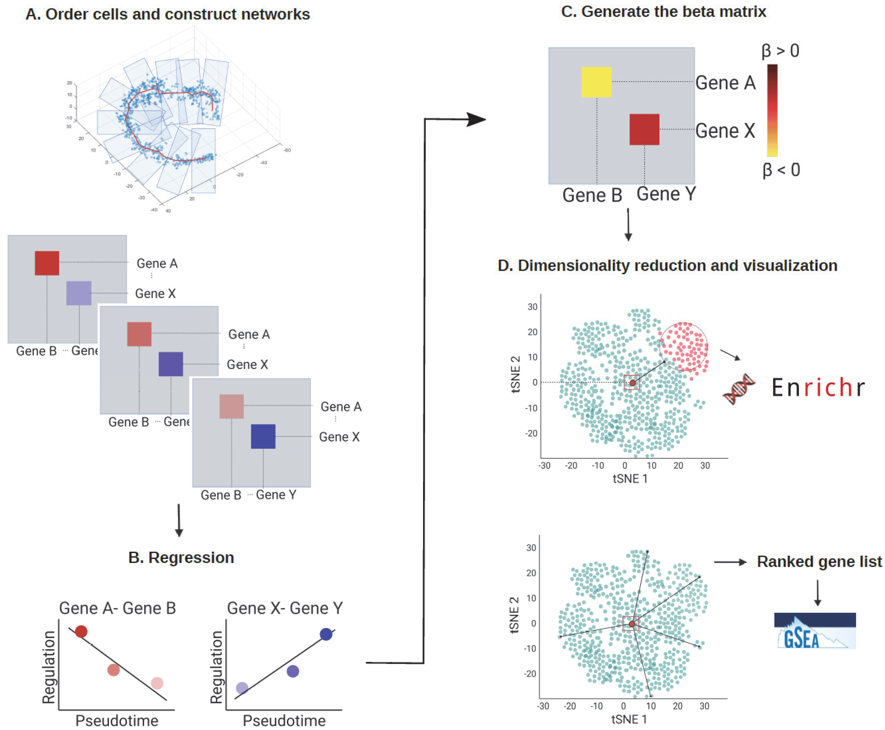

# scInTime Analysis for Cellular Differentiation

## Project Description
This repository contains the R code used for the analysis presented in the paper:
"scInTime: A Computational Method Leveraging Single-Cell Trajectory and Gene Regulatory Networks to Identify Master Regulators of Cellular Differentiation" published in Genes 2022. The study introduces a novel unsupervised machine learning framework that integrates single-cell RNA sequencing data with trajectory inference and gene regulatory networks to identify key regulators of cellular differentiation.

## The analytical framework of scInTime

## Code Organization
- `code/`:
  - `CardiomyocyteDataAnalyse.r`: Analysis of cardiomyocyte data.
  - `HNSCC6DataAnalyse.r`: Analysis of head and neck squamous cell carcinoma data.
  - `ZebrafishDataAnalyse.r`: Analysis of zebrafish data.
- `generate_networks/`:
  - Contains scripts to generate gene regulatory networks at different pseudotime points.
- `data/`:
  - Contains all data files used in the analyses, organized by study.

## Packages Used
The analysis relies on several **R packages** which are crucial for the processing and analysis of the single-cell RNA-seq data:
- **`Seurat`**: For preprocessing, normalization, and visualization of single-cell data.
- **`monocle3`**: Used for trajectory inference in single-cell data.
- **`scTenifoldNet`**: A package developed to build gene regulatory networks from single-cell data.
- Other visualization and analysis packages: **`ggplot2`**, **`ComplexHeatmap`**, **`circlize`**.

## Analysis Steps
The analysis can be broken down into the following steps:
1. **Data Preprocessing**: Raw data is processed using `Seurat` for quality control and normalization.
2. **Trajectory Inference**: `Monocle3` is used to infer cellular trajectories and pseudotime.
3. **Network Generation**: Using `scTenifoldNet`, gene regulatory networks are constructed for cells at different pseudotime stages.
4. **Differential Expression Analysis**: Identification of genes that show significant changes over pseudotime.
5. **Network Analysis**: Analyze changes in gene regulatory networks across pseudotime to pinpoint key regulatory genes.

Please refer to each script for detailed implementation of these steps.
